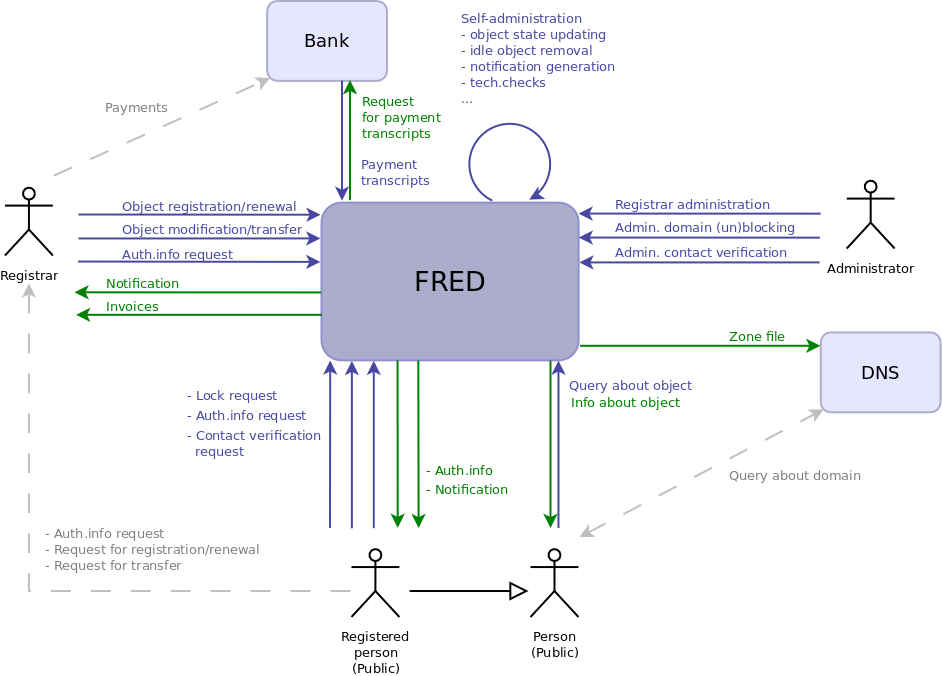

.. _FRED-Arch-Blackbox:

Blackbox model
==========================

.. only:: mode_structure

   .. struct-start

   **Sources:** OLDREPO + NOTES :ref:`??? <src>`
   | **AoW:** (used old picture) 3 days to create a new picture

   **Chapter outline:**

   * *external interfaces*
   * 3rd-party software required for operation
      * PostgreSQL, Postfix, CORBA Nameserver, Apache, DNS server...

   .. struct-end

.. _fig-arch-blackbox:

   Context diagram – Overview of users and general data flows
