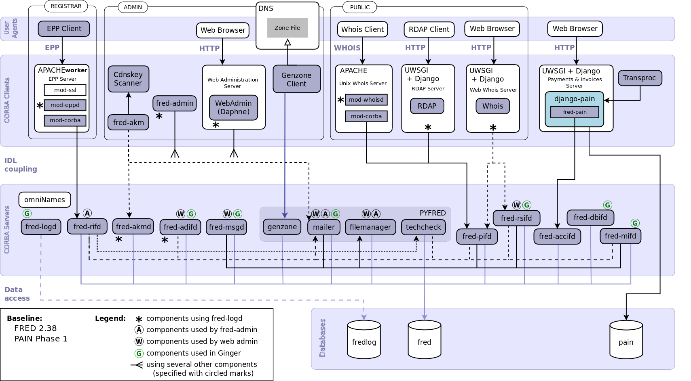

.. _FRED-Arch-TopComponents:

Top-level components
===============================

.. only:: mode_structure

   .. struct-start

   **Sources:** OLDREPO + NOTES :ref:`??? <src>`
   | **AoW:** 3 days = *2 days (base on old picture)*

   **Chapter outline:**

   * CORBA servers, CORBA clients, user agents
   * internal interfaces (CORBA IDL)

   .. struct-end

This chapter contains diagrams and brief descriptions of FRED top-level
components and their relationships.

.. _fig-arch-components:

   Diagram of FRED components

**Legend:**

* *violet* components are developed by the CZ.NIC and they are parts
  of the FRED software
* *white* components are not developed by the CZ.NIC but are required
  for the proper function of the Registry
* *green* components are developed by the CZ.NIC but they are not
  parts of the FRED software (they are of internal GINGER projects)
* *arrows* signify direct cooperation of components (the arrow points
  at the component which serves the other component)

.. contents:: Chapter TOC
   :local:

.. include:: Databases.rst

.. include:: CORBAServers.rst

.. include:: CORBAClients.rst

.. include:: UserAgents.rst
