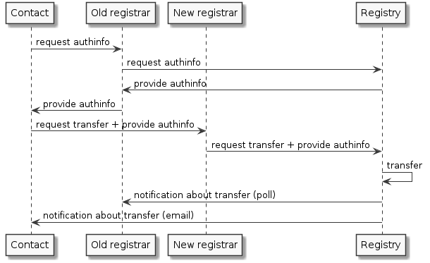

.. index::
   pair: transfer; process

Object transfer
===============

Object transfer is a mechanism that allows to change the :term:`designated registrar`
of an object.

Each object has **authorization information** (or authinfo, also called a transfer password)
that must be provided with the transfer request to authorize the transfer.

The transfer process in the FRED is different from the standard one
(see :rfc:`5730#section-2.9.3.4`) and it works as follows:

#. A contact linked to an object intended for transfer requests authinfo of the object.
   He can do so via the current registrar, via the new registrar or
   by submitting a \ :term:`public request` to the Registry directly.
#. The authinfo is provided to the contact either through one of the involved
   registrars or sent from the Registry.
#. The contact requests the transfer from the new registrar and provides
   the authinfo.
#. The new registrar requests the transfer from the Registry (via EPP) and
   provides the authinfo.
#. The Registry transfers the object immediately and generates new authinfo
   for the transferred object.
#. The Registry notifies the old registrar and the linked contacts about the transfer.

This model favours the holder because it does not allow
the current designated registrar to reject nor inhibit the transfer.

.. NOTE Public request and Domain browser provide direct access to authinfo
   without involving a registrar

.. _fig-features-transfer:

   Sequence diagram – Object transfer process

Further authorization options
-----------------------------

A transfer of a domain may also be authorized using authinfo of the domain holder
or any of its administrative contacts.

A transfer of a nsset or keyset may also be authorized using authinfo of any
of its technical contacts.
