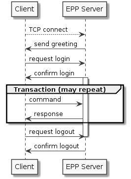

.. _FRED-EPPRef-Basics-HowEPPWorks:

Introduction to the EPP
=======================

This section introduces basic aspects of the EPP,
describes the activities of normal communication between a client and
the EPP server and explains in general how FRED extends the standard protocol.

Service aspects
---------------

EPP has the following basic service aspects:

* service discovery,
* commands & responses, and
* an extension framework.

**Service discovery** allows a client to be aware of managed objects,
supported services, extensions and policy of the EPP server.

**Commands** are used by a client either to establish and to end a session
or to request standard operations over objects managed in the Registry.
The server replies to the commands with coordinated
**responses**, each containing the result of the requested operation.

The **extension framework** allows the protocol to be extended on several levels:

* *command/response-level* extensions – extensions of standard commands & responses,
* *object-level* extensions – object extensions with definitions of managed
  objects and relationship of protocol requests and replies to those objects,
* *protocol-level* extensions – protocol extensions with non-standard requests
  (such as new commands).

The FRED extends the EPP on all three levels as described :ref:`below <extensions-use>`.

Protocol characteristics
------------------------

* EPP is a stateful protocol. (The server retains session information
  about each client.)
* All comunication is initiated by a client. (The server does not send anything
  to a client unless it was requested by the client.)
* The server responds to a communication-initiating request made by a client
  (which can be either a TCP connection request or an EPP service
  discovery request (``hello``)) by returning a ``greeting`` to the client.
* The server responds to each EPP command with a coordinated response
  that describes the results of processing the command. (See also
  `EPP Server State Machine <https://tools.ietf.org/html/rfc5730#page-5>`_
  for a more detailed description of server's behaviour.)
* Commands are processed by the server in the order they are received
  from clients.
* Commands are atomic. (There is no partial success or partial failure.)
* The FRED EPP server does not allow delayed execution of commands (pending),
  commands are performed immediately.

.. * Commands are idempotent. (Executing a command more than once has the same
  net effect on object state as successfully executing the command once.)
  NOTE Some are not. (example: update)

Normal communication
--------------------

Normal communication between a client and the EPP server is:

* The client connects to the server over TCP+TLS.
* The server identifies itself and the commands and extensions that it supports.
  (Sends the ``greeting``.)
* The client logs in by supplying login name, password and session options.
* The server establishes a session and confirms the login.
* The client issues commands to the server, which replies immediately with a result.
* The client then idles until it has more commands to send, querying periodically
  for :doc:`poll notifications </EPPReference/CommandStructure/Poll/index>`.
* The client logs out (or times out).
* The server terminates the session and confirms the logout.
* If a session has not been established for a client, the server rejects
  all commands from the client (except for the login).

.. _fig-epp-conversation:

  Sequence diagram – Normal EPP communication

.. _extensions-use:

Use of the extension framework in FRED EPP
------------------------------------------

* :doc:`protocol-level extensions <ProtocolExtensions>`
   * define some custom commands (listing commands, creditInfo, sendAuthInfo, test)
   * XPath location: ``/epp/extension/*:*``
* :doc:`object-level extensions <../ManagedObjects/index>`
   * define custom managed objects (attributes, command-response mapping)
   * XPath locations:
      * :samp:`/epp/command/{std-cmd}/{object}:{std-cmd}` where ``std-cmd`` can
        be any standard command, and
      * :samp:`/epp/extension/fred:extcommand/fred:{ext-cmd}/{object}:{ext-cmd}`
        where ``ext-cmd`` can be any protocol-extension command
* command/response-level extensions
   * define command-response mapping for additional attributes that extend some managed objects
   * :ref:`command extensions <command-ext>` – XPath location: :samp:`/epp/command[{std-cmd}]/extension/*:*` where ``std-cmd`` can be any standard command
   * :ref:`response extensions <response-ext>` – XPath location: :samp:`/epp/response[result]/extension/*:*`
