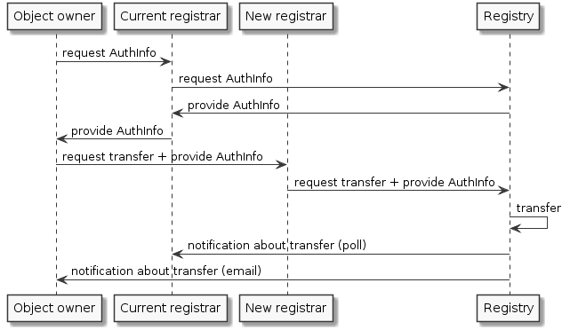

.. index::
   pair: transfer; process

Object transfer
===============

Object transfer is a mechanism that allows to change the designated registrar
of an object.

Each object has **authorization information** (or authInfo, also called a transfer password)
that must be provided with the transfer request to authorize the transfer.

The transfer process in the FRED is different from the standard one
(see :rfc:`5730#section-2.9.3.4`) and it works as follows:

#. Object owner requests auth.info of the object intended for transfer.
   He can do so via the current registrar, via the new registrar or
   by submitting a public request to the Registry directly.
#. The auth.info is provided to the owner either through one of the involved
   registrars or sent from the Registry.
#. Object owner requests the transfer from the new registrar and provides
   the auth.info.
#. The new registrar requests the transfer from the Registry (via EPP) and
   provides the auth.info.
#. The Registry transfers the object immediately and generates new auth.info
   for the transfered object.
#. The Registry notifies the old and the owner about the transfer.

This model favours the end user (registrant) because it does not allow
the current designated registrar to reject nor inhibit the transfer.

.. NOTE Public request and Domain browser provide direct access to AuthInfo
   without involving a registrar

.. NOTE Tech/Admin-contacts can use their contact password to transfer linked objects
   of other types (even domains),
   see also https://tools.ietf.org/html/rfc5731#section-3.2.4

.. _fig-features-transfer:

   Sequence diagram – Object transfer process
