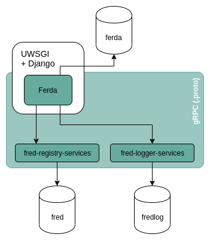

Introduction
============

Ferda is a new and enhanced web administration interface and tool, which is
expected to replace the :doc:`Daphne webadmin </Features/AdminIF/WebAdmin>`
in the future.

.. Important:: This tool is not yet publicly available as it's still
   in development. We will announce officially once it will be released.

The current set of features is listed in :doc:`/Features/AdminIF/Ferda`.

Architecture
------------

Communication between front end and back end is achieved through the
`gRPC framework <https://grpc.io/>`_.

The back end is written in C++ and accesses the FRED databases.

The front end is a Django project with a separate database.

.. _fig-arch-ferda:

.. rubric:: Diagram of Ferda architecture

..
   raw:: html
   :file: _graphics/architecture.svg

.. rubric:: Legend

* *Azure* components are developed by the CZ.NIC and they are parts
  of Ferda communicating through the gRPC framework.
* *Arrows* signify direct cooperation of components (the arrow points
  at the component which serves the other component); neither the colour
  nor the style of arrows carry any meaning.
